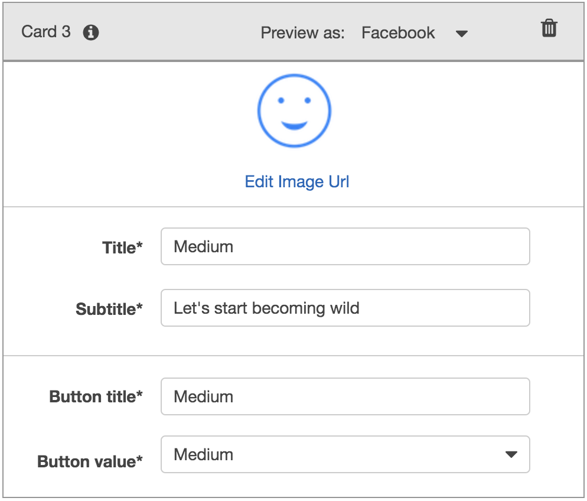
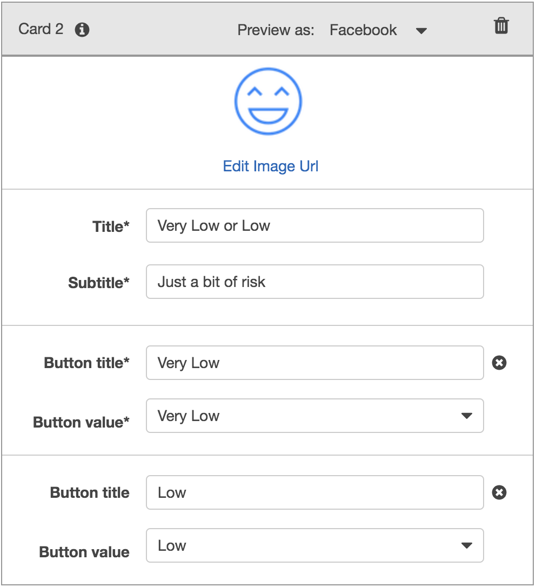
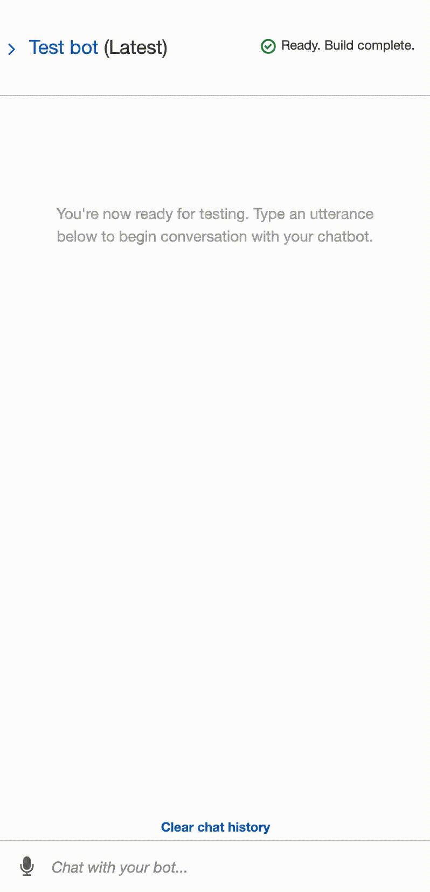

# The Power of the Cloud - Amazon Lex

## Robo Advisor for Retirement Plans

*Photo by [Alex Knight](https://www.pexels.com/@alex-knight-1272316?utm_content=attributionCopyText&utm_medium=referral&utm_source=pexels) from [Pexels](https://www.pexels.com/photo/high-angle-photo-of-robot-2599244/?utm_content=attributionCopyText&utm_medium=referral&utm_source=pexels) | [Free License](https://www.pexels.com/photo-license/)*

### Background

You were hired as a digital transformation consultant by one of the most prominent retirement plan providers in the country; they want to increase their client portfolio, especially by engaging young people. Since machine learning and NLP are disrupting finance to improve customer experience, you decide to create a robo advisor that could be used by customers or potential new customers to get investment portfolio recommendations for retirement.

Here we build using Amazon Web Services with mastered Python superpowers, to create a bot that will recommend an investment portfolio for a retirement plan.

Main Task:

1. **[Initial Robo Advisor Configuration:](#Initial-Robo-Advisor-Configuration)** Define an Amazon Lex bot with a single intent that establishes a conversation about the requirements to suggest an investment portfolio for retirement.

2. **[Build and Test the Robo Advisor](#Build-and-Test-the-Robo-Advisor):** Make sure that your bot is working and responding accurately along with the conversation with the user, by building and testing it.

3. **[Enhance the Robo Advisor with an Amazon Lambda Function:](#Enhance-the-Robo-Advisor-with-an-Amazon-Lambda-Function)** Create an Amazon Lambda function that validates the user's input and returns the investment portfolio recommendation. This task includes testing the Amazon Lambda function and making the integration with the bot.

---

### Files

* [lambda_function.py](RoboAdvisor/lambda_function.py)
* [correct_dialog.txt](RoboAdvisor/Test_Cases/correct_dialog.txt)
* [age_error.txt](RoboAdvisor/Test_Cases/age_error.txt)
* [incorrect_amount_error.txt](RoboAdvisor/Test_Cases/incorrect_amount_error.txt)
* [negative_age_error.txt](RoboAdvisor/Test_Cases/negative_age_error.txt)

---

### Instructions

#### Initial Robo Advisor Configuration

In this section, We create the `RoboAdvisor` bot and add an intent with its corresponding slots.

1. **Create Bot** : Sign in into your AWS Management Console and [create a new custom Amazon Lex bot](https://console.aws.amazon.com/lex/home). Use the following parameters:

    * **Bot name:** RoboAdvisor
    * **Output voice**: Salli
    * **Session timeout:** 5 minutes
    * **Sentiment analysis:** No
    * **COPPA**: No

2. **Create intent** : Create the `RecommendPortfolio` intent, and configure some sample utterances as follows (you can add more utterances at your own criteria):

    * I want to save money for my retirement
    * I'm ​`{age}​` and I would like to invest for my retirement
    * I'm `​{age}​` and I want to invest for my retirement
    * I want the best option to invest for my retirement
    * I'm worried about my retirement
    * I want to invest for my retirement
    * I would like to invest for my retirement

3. **Create Slot** : This bot will use four slots, three using built-in types and one custom slot named `riskLevel`. Define the three initial slots as follows:

    | Name             | Slot Type            | Prompt                                                                    |
    | ---------------- | -------------------- | ------------------------------------------------------------------------- |
    | firstName        | AMAZON.US_FIRST_NAME | Thank you for trusting on me to help, could you please give me your name? |
    | age              | AMAZON.NUMBER        | How old are you?                                                          |
    | investmentAmount | AMAZON.NUMBER        | How much do you want to invest?                                           |

4. **Create the custom Slot** : The `riskLevel` custom slot will be used to retrieve the risk level the user is willing to take on the investment portfolio; create this custom slot as follows:

    * **Name:** riskLevel
    * **Prompt:** What level of investment risk would you like to take?
    * **Maximum number of retries:** 2
    * **Prompt response cards:** 4

    Configure the response cards for the `riskLevel` slot as is shown bellow:

    | Card 1                              | Card 3                              |
    | ----------------------------------- | ----------------------------------- |
    |  |   |

    | Card 2                              | Card 4                              |
    | ----------------------------------- | ----------------------------------- |
    |    |    |

    **Note:** You can download free icons from [this website](https://www.iconfinder.com/) or you can use the icons provided in the [`Icons` directory](Icons/).

5. **Setup Confirmation Prompt** : Move to the *Confirmation Prompt* section, and set the following messages:

    * **Confirm:** Thanks, now I will look for the best investment portfolio for you.
    * **Cancel:** I will be pleased to assist you in the future.

6. **Error Handling** : Leave the error handling configuration for the `RecommendPortfolio` bot with the default values.

#### Build and Test the Robo Advisor

Build the bot and test it in the chatbot window.

#### Enhance the Robo Advisor with an Amazon Lambda Function

In this section, Create an Amazon Lambda function that will validate the data provided by the user on the Robo Advisor. Start by creating a new lambda function from scratch and name it `recommendPortfolio`. Select Python 3.7 as runtime.

Code provided on [lambda_function.py](RoboAdvisor/lambda_function.py)

The `recommend_portfolio()` function follows these guidelines:

1. User Input Validation

    * The `age` should be greater than zero and less than 65.
    * the `investment_amount` should be equal to or greater than 5000.

2. Investment Portfolio Recommendation
    - Once the intent is fulfilled, the bot should response with an investment recommendation based on the selected risk level as follows:

    * **none:** "100% bonds (AGG), 0% equities (SPY)"
    * **very low:** "80% bonds (AGG), 20% equities (SPY)"
    * **low:** "60% bonds (AGG), 40% equities (SPY)"
    * **medium:** "40% bonds (AGG), 60% equities (SPY)"
    * **high:** "20% bonds (AGG), 80% equities (SPY)"
    * **very high:** "0% bonds (AGG), 100% equities (SPY)"

3. Test Case 
    - Once finish coding lambda function, test it using the [sample test cases](RoboAdvisor/Test_Cases/).

    - After successfully testing your code, open the Amazon Lex Console and navigate to the `RecommendPortfolio` bot configuration, integrate new lambda function by selecting it in the _Lambda initialization and validation_ and _Fulfillment_ sections. Build the bot, and we should be able to have conversation as follows.

#### Demo

 

#### Integrating an Amazon Lex Bot with Slack

Finally we are ready to integrate our Bot with Slack. Follow the guildlines in the link [Integration with Slack](https://docs.aws.amazon.com/lex/latest/dg/slack-bot-association.html)

 